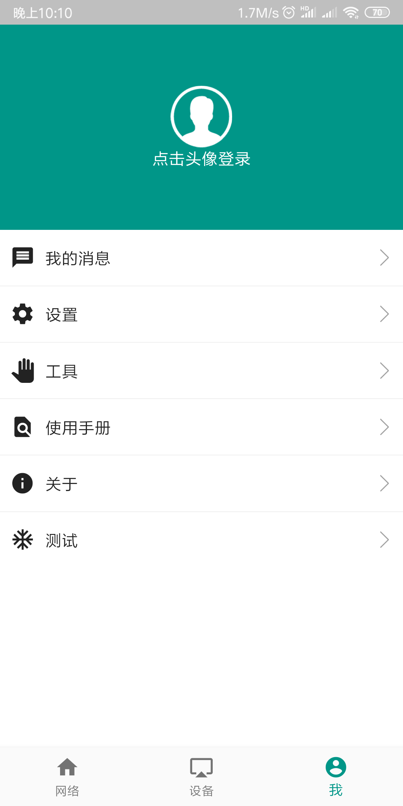

# OpenIoTHUb
### Remote access to your network services (behind a NAT or firewall) with p2p transport

[README](README.md) | [中文文档](README_zh.md)

[Download from releases](https://github.com/OpenIoTHub/OpenIoTHub/releases)

#### What is OpenIoTHub
💖A free IoT platform and private cloud platform, help you access remote services and IoT Devices.

#### Download OpenIoTHub App：
  * Android,Windows,Linux,Darwin version：https://github.com/OpenIoTHub/OpenIoTHub/releases
  * iOS version：https://apps.apple.com/cn/app/id1501554327
#### OpenIoTHub Gateway Download（Continuously running on the LAN to receive access requests）:
  * Windows,Linux,Darwin version：https://github.com/OpenIoTHub/gateway-go/releases
  * This App(OpenIoTHub) also has a **Built in** gateway provides QR code addition method
#### OpenIoTHub Server Download（high level, common user not necessary）:
> #### self hosted server for OpenIoTHub（high level）：
> * https://github.com/OpenIoTHub/server-go/releases
> * The server should configure its own port and secret key. The gateway can use the self built server by using the information and public network address you have configured
---
#### course：
 * BiliBili：https://space.bilibili.com/1222749704
---
#### supported features：
- [x] Support ipv4 p2p
- [x] Support ipv6 p2p
- [x] scan [gateway](https://github.com/OpenIoTHub/gateway-go) QR add a gateway
- [x] find [gateway](https://github.com/OpenIoTHub/gateway-go)
- [x] Support configuration saving, and load the old configuration directly before the next startup
- [x] Support direct opening of Intranet website port
- [x] Support offline download of aria2 using intranet directly
- [x] Support SSH terminals with direct access to Intranet
- [x] Support file access via intranet SSH (upload and download)
- [x] Support to open VNC desktop of Intranet machine directly
- [x] Support calling mobile phone RDP client to open the desktop of Intranet windows
- [x] Support mapping FTP protocol
- [x] Network boot (WOL)
- [ ] Directly back up the address book to the private cloud
- [x] Support the discovery and control of smart home devices ([IOT device]（ https://github.com/iotdevice/todo-list )

---
#### Development：
#### Getting Started

This project is a starting point for a Flutter application.

A few resources to get you started if this is your first Flutter project:

- [Lab: Write your first Flutter app](https://flutter.io/docs/get-started/codelab)
- [Cookbook: Useful Flutter samples](https://flutter.io/docs/cookbook)

For help getting started with Flutter, view our 
[online documentation](https://flutter.io/docs), which offers tutorials, 
samples, guidance on mobile development, and a full API reference.

---
#### Preview
  * smart home control(https://github.com/iotdevice/esp8266-switch)

  * remote network list

  * mdns service find list

  * device manager

  * device list

  * common devices

  * tcp service of common device

  * the tcp open method of common device

  * me

