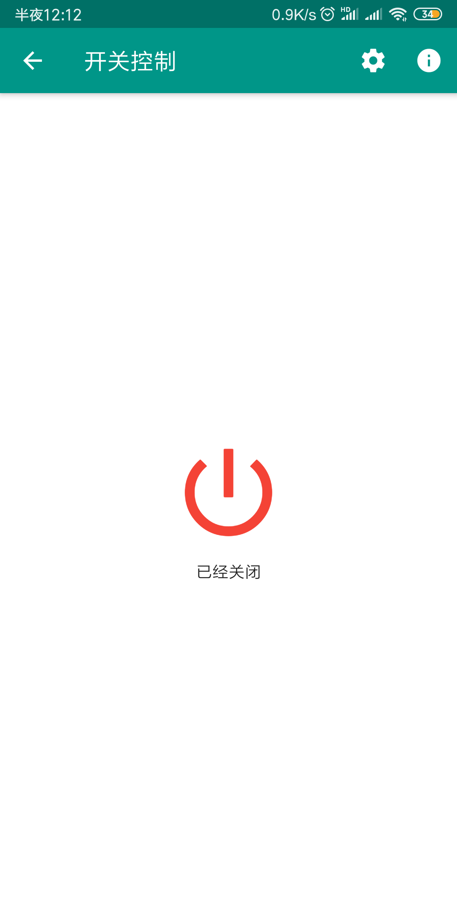
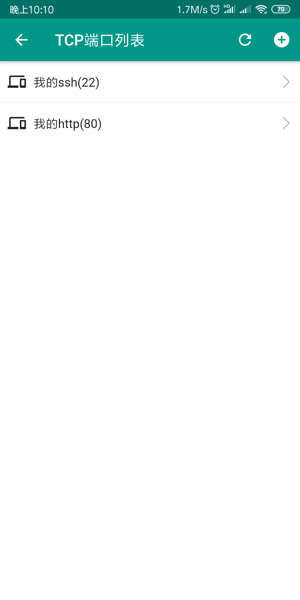

# 云亿连（内网穿透远程访问内网的端口、服务和设备）

[README](README.md) | [中文文档](README_zh.md)

#### 云亿连支持内网穿透，可以帮助用户通过转发或p2p访问处于内网的端口服务和设备、用户只要登录后扫码[网关](https://github.com/OpenIoTHub/gateway-go)或者本应用内置网关即可远程访问网关所在的网络

QQ群号: 251227638 

#### OpenIoTHub（云亿连）是什么？
云亿连一个免费的物联网和私有云平台，支持内网穿透,物联网设备、私有云

#### 下载地址(云亿连)：
  * 其他版本：https://github.com/OpenIoTHub/OpenIoTHub/releases
  * iOS版本：https://apps.apple.com/cn/app/id1501554327
#### 内网网关下载地址:
  * 命令行版本：https://github.com/OpenIoTHub/gateway-go/releases
  * UI版本：本APP内置，显示二维码
#### 云亿连 服务器 下载（高阶, 一般用户用网关自动生成的配置文件中的服务器就够了）:
> #### 自建转发服务器下载（高阶）：
> * https://github.com/OpenIoTHub/server-go/releases
> * 服务器请自行配置端口和秘钥，网关使用你配置的信息和公网地址就可以使用自建服务器
---
#### 教程：
  * BiliBili：https://space.bilibili.com/1222749704
---
#### 支持的功能：
- [x] 支持ipv4 p2p
- [x] 支持ipv6 p2p
- [x] 扫描二维码添加一个 [网关](https://github.com/OpenIoTHub/gateway-go)
- [x] 支持搜索网关
- [x] 支持配置保存，下一次启动直接加载之前的旧配置
- [x] 支持直接打开内网的网站端口
- [x] 支持直接使用内网的aria2离线下载
- [x] 支持直接访问内网的ssh的终端
- [x] 支持通过内网ssh访问机器的文件（上传下载）
- [x] 支持直接打开内网机器的vnc桌面
- [x] 支持调用手机RD Client打开内网windows的桌面
- [x] 支持映射ftp协议
- [x] 网络开机（WOL）
- [ ] 直接备份通讯录到私有云
- [x] 支持发现并操控智能家居设备([IoT Device](https://github.com/iotdevice/todo-list))

---
#### 开发：
#### 这是一个Flutter项目

This project is a starting point for a Flutter application.

A few resources to get you started if this is your first Flutter project:

- [Lab: Write your first Flutter app](https://flutter.io/docs/get-started/codelab)
- [Cookbook: Useful Flutter samples](https://flutter.io/docs/cookbook)

For help getting started with Flutter, view our 
[online documentation](https://flutter.io/docs), which offers tutorials, 
samples, guidance on mobile development, and a full API reference.

---
#### 预览图
  * 智能家居设备操控(https://github.com/iotdevice/esp8266-switch)

  * 远程网络列表

  * 内网由mDNS声明的服务

  * 设备管理器

  * 设备列表

  * 普通设备的服务

  * 普通设备的TCP服务

  * TCP端口打开方式

  * 我

